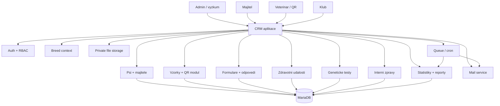

# Navrh architektury CRM pro vyzkum plemen psu

Datum navrhu: 2026-06-29

## 1. Cil aplikace

Cilem je vytvorit CRM system pro dlouhodoby vyzkum jednotlivych plemen psu, spravu psu, majitelu, veterinarnich odberu, zdravotnich dat, genetickych testu, komunikace s majiteli a nahledovych statistik pro zastitujici kluby.

Aplikace musi podporovat ctyri hlavni urovne pristupu:

- admin / vyzkumny tym,
- klub,
- veterinar,
- majitel.

System ma navazat na existujici aplikaci `C:\Users\Ekospol\Documents\Codex\dog_research`, ktera bezi na `vyzkum.zootabor.eu`. Tato existujici aplikace neni vhodna jako kompletni CRM zaklad, ale obsahuje hotovy a uzitecny modul pro QR workflow odberovych sad, veterinarni formular, majitelsky formular, souhlasy, rodokmeny, tokenizovane odkazy a zakladni administraci vzorku. Doporuceni je tedy nebourat ji, ale prenest/integrovat jeji funkcnost do nove aplikace jako modul "Vzorky a QR registrace".

## 2. Vstupni podklady

Z uzivatelskeho zadani:

- sprava vice plemen s prepinacem plemene v admin UI,
- prednahrany seznam psu a majitelu pred prvnim prihlasenim uzivatelu,
- rucni prirazeni pes + majitel vyzkumnym tymem,
- tlacitko "Odeslat heslo" pro majitele, kteri jeste nemaji ucet,
- platnost registracniho/set-password odkazu 1 mesic,
- majitel po prihlaseni vidi sve psy,
- pri zmene majitele muze puvodni majitel zadat jmeno a e-mail noveho majitele,
- majitel muze menit kontaktni udaje, sekundarni e-mail a vice telefonnich cisel,
- majitel nema primo menit jadrove udaje psa, ale muze poslat poznamku/zadost adminovi,
- priprava pro interni chat,
- zdravotni udaje maji byt sbirany pres tvoritelne formulare podobne Google Forms,
- veterinar potrebuje hlavne cast registrace psa/vzorku,
- klub potrebuje nahledove statisticke tabulky,
- geneticke testy potrebuji evidovat geny a nukleotidy/genotypy u psu, sortable tabulky,
- bezpecnost, N+1 dotazy, skalovatelnost a dlouhodoba udrzitelnost jsou dulezite.

Z rucnich fotek ve workspace:

- admin potrebuje seznam vsech vzorku/psu s filtry podle majitele, jmena psa, plemene, genu, data posledni aktualizace a stavu zivy/uhynuly,
- po rozkliknuti vzorku/psa admin vidi vsechny udaje psa,
- majitel ma videt kontaktni udaje a mit moznost je aktualizovat,
- majitel ma videt sve psy, potvrdit/opravit/doplnit udaje a napsat poznamku,
- system ma umet filtrovat podle plemene,
- u genetickych sloupcu se pocita s hodnotami typu `GG/CC`.

Z existujici aplikace `dog_research`:

- PHP 8.2, MariaDB 10.4, custom MVC bez frameworku,
- tabulky `vets`, `sample_batches`, `samples`, `owners`, `dogs`, `consents`, `pedigree_documents`, `lab_records`, `audit_logs`,
- QR odkazy `/vet/{sample_id}/{token}` a `/dog/{sample_id}/{token}`,
- tokeny se ukladaji jako SHA-256 hash,
- formular pro veterinare uklada cip, typ vzorku, pocet materialu, datum odberu,
- formular pro majitele uklada psa, kontakt, souhlas a rodokmen,
- admin umi generovat davky vzorku a CSV export,
- e-mailova cast je jen pripravena konfiguracne (`MAIL_FROM`, `MAIL_ENABLED`), ale nebyla nalezena hotova SMTP/mail implementace k preneseni.

## 2.1 Potvrzena rozhodnuti po upresneni

- Technologie: ciste PHP + MariaDB. Pro ocekavany rozsah dat to staci, pokud bude aplikace mit rozumne schema, indexy, server-side strankovani a zadne N+1 dotazy.
- Hosting/domana: nova aplikace pobezi na `vyzkum.zootabor.eu`.
- E-mail: pouzivat adresu `vyzkum@zootabor.eu`; SMTP/IMAP parametry budou dodane pres `.env`.
- Databaze plemen: centralni schema s `breed_id`, ne fyzicke zapisovaci tabulky pro kazde plemeno.
- Stara aplikace: data se nemigruji; prenese se jen funkcnost QR/vzorku. Pripadne historicke importy si udela vyzkumny tym sam.
- Plemena: cca 20 az 30.
- Majitele: orientacne cca 80 na plemeno.
- Psi: orientacne cca 250 az 350 na plemeno nebo v mensim celkovem rozsahu podle studie; architektura musi bez problemu zvladnout i vyssi jednotky tisic az nizsi desitky tisic psu.
- Vzorky: otevreny pocet podle uspechu DNA odberu.
- Genetika: bezne cca 4 PCR markery. PCR vysledky patri do strukturovanych tabulek, budou skryte pred majiteli a viditelne jen vyzkumnemu tymu a klubum. GWAS se v prvni verzi vynecha, protoze data jsou pro navrhovany CRM system prilis robustni.
- Kluby: mohou videt jednotlive psy a jmeno majitele, ale ne kontaktni udaje. Minimalni anonymizacni limit pro agregace neni potreba.
- Majitel: muze primo upravit vlastni kontakty, datum umrti psa, zdravotni dokumentaci a spustit zmenu majitele.
- Zmena majitele: automaticky po potvrzeni novym majitelem, bez nutneho admin schvaleni.
- Veterinar: primarne QR/token pristup; anonymizovany veterinarni dashboard se statistikou odeslanych vzorku podle plemen patri do zakladniho planu.
- Vyzkumny tym: od zacatku jeden centralni admin/vyzkumny ucet se vsemi pravy, funkcni po celou dobu zivota aplikace.
- GDPR/souhlasy: texty jsou v procesu u pravniho oddeleni Zoo Tabor. Implementacne je lepsi dodat je jako obsahovy HTML fragment nacitany do PHP layoutu, ne jako celou HTML page s vlastnim header/footer.
- Zdravotni formulare: primarne globalni pro cele plemeno, aby byla data porovnatelna; vzdy musi existovat volitelna poznamka.
- Geneticke vysledky: rucni zadani i CSV import podle `sample_id`; primarni CSV format je siroky format jako `import_system.csv`, tedy `sample_id`, fenotyp a nasledne genotypove sloupce pro jednotlive geny/markery.

Pripravena e-mailova konfigurace v `.env`:

```env
# Email Configuration - SMTP
SMTP_HOST=linux.ekospol.cz
SMTP_PORT=
SMTP_USER=zoo_vyzkum
SMTP_PASS=
SMTP_FROM=
SMTP_FROM_NAME=
SMTP_USE_STARTTLS=

# Email Configuration - IMAP
IMAP_HOST=linux.ekospol.cz
IMAP_PORT=
IMAP_USE_SSL=
IMAP_SENT_FOLDER=
IMAP_SAVE_TO_SENT=
```

## 3. Hlavni architektonicke rozhodnuti

### 3.1 Doporuceny smer

Doporuceny smer je nova modularni monoliticka aplikace, ktera bude mit vlastni cisty datovy model, role, UI a autorizacni vrstvu. Existujici `dog_research` se pouzije jako zdroj funkcnosti pro modul QR/vzorky.

Proc modularni monolit:

- aplikace bude mit hodne propojenych dat, ktera patri do jedne domeny,
- je jednodussi na vyvoj, nasazeni, audit a zalohovani nez sada mikrosluzeb,
- jde dobre provozovat na soucasnem PHP/MariaDB hostingu,
- pozdeji lze oddelit jen narocne casti: statistiky, importy, e-maily, soubory, analytiku.

### 3.2 Nedoporuceny smer

Nedoporucuje se stavet cele CRM "okolo" stavajici `dog_research` aplikace bez vetsi refaktorizace. Stary projekt ma dobry MVP rozsah, ale nema:

- plne uzivatelske ucty a RBAC,
- multi-breed kontext,
- robustni model kontaktu,
- formulare s verzemi,
- interni komunikaci,
- klubove statistiky,
- plnohodnotny geneticky model,
- testovatelnou aplikacni vrstvu pro velky system.

### 3.3 Varianta technologii

Potvrzena varianta:

- Backend: ciste PHP 8.x podle hostingu, bez nutnosti plneho frameworku.
- DB: MariaDB/MySQL kvuli soucasnemu prostredi.
- UI: server-renderovane stranky pro admin/portal + lehke interaktivni komponenty.
- Frontend komponenty: tabulky s filtrovanim, razenim a strankovanim; neni nutna plna SPA.
- Background jobs: cron/lehka fronta pro e-maily, importy, exporty, prepocty statistik.
- Soubory: mimo public root; do budoucna S3-kompatibilni uloziste.
- E-mail: novy SMTP/notifikacni modul pro `vyzkum@zootabor.eu`, s auditovanym logem odeslani.

Protoze se zustane u cisteho PHP bez frameworku, je nutne vedome dodelat veci, ktere framework normalne resi:

- router,
- migrace,
- auth,
- session hardening,
- middleware,
- validace,
- formularove requesty,
- autorizacni policy,
- cron/queue abstraction,
- testovaci infrastrukturu.

Pro ocekavane objemy dat je ciste PHP + MariaDB dostatecne. Dulezitejsi nez framework je disciplinovane schema, priprava dotazu, indexy, autorizacni vrstva, audit a testy.

## 4. Logicka architektura



## 5. Moduly aplikace

### 5.1 Auth, ucty a role

Funkce:

- jeden centralni admin/vyzkumny ucet pro MVP,
- uzivatelske ucty pro kluby a majitele,
- veterinar primarne bez uctu, pristup pouze pres QR/token; volitelne pozdeji ucet pro anonymizovane statistiky,
- hesla ukladat pres `password_hash` s Argon2id nebo bcrypt; nepouzivat vlastni salt logiku,
- registracni odkazy ukladat jen jako hash tokenu,
- set-password token s expiraci 1 mesic,
- reset hesla s kratsi expiraci, napr. 1 hodina,
- 2FA pro centralni admin/vyzkum ucet,
- session hardening, CSRF, rate limiting.

Role:

- `research_admin`: centralni vyzkumny ucet s plnym pristupem ke vsem plemenum a nastavenim,
- `club_viewer`: read-only statistiky pro prirazena plemena,
- `vet`: QR formular vzorku; volitelne anonymizovany statisticky portal,
- `owner`: vlastni psi, vlastni kontakty, formulare a zpravy.

Do budoucna je mozne pridat individualni vyzkumne ucty kvuli lepsimu auditu. V MVP se zmeny centralniho uctu audituji jako `research_team`.

### 5.2 Breed context

V admin UI musi byt globalni prepinac plemene:

- `Vsechna plemena`,
- konkretni plemeno,
- rychly vyber naposledy pouzitych plemen.

Breed context se musi propisovat do:

- seznamu psu,
- seznamu majitelu,
- vzorku,
- zdravotnich formularu,
- genetickych testu,
- statistik,
- opravneni,
- exportu.

Kazdy dotaz nad domenovymi daty musi mit explicitni filtr `breed_id`, pokud uzivatel nema pravo videt vse.

### 5.3 Psi a majitele

Admin/vyzkum muze:

- importovat psy a majitele pred prvnim prihlasenim,
- rucne vytvaret a upravovat psy,
- prirazovat psa k majiteli,
- potvrdit zmenu majitele,
- sledovat stav potvrzeni udaju,
- menit udaje psa vcetne:
  - plemeno,
  - jmeno psa,
  - chovna stanice,
  - datum narozeni,
  - cislo cipu,
  - cislo prukazu / pedigree,
  - datum a pricina umrti,
  - kastrace,
  - nemoci,
  - zdravotni vysetreni,
  - datum prijeti vzorku.

Majitel muze:

- videt psy, kteri jsou mu prirazeni,
- potvrdit, ze je pes stale jeho,
- spustit zmenu majitele,
- napsat poznamku nebo zadost o opravu,
- menit sve kontaktni udaje,
- primo ulozit datum umrti psa,
- primo vlozit zdravotni dokumentaci a zdravotni udalosti,
- vyplnovat dotazniky.

Majitel by nemel primo menit jadrove identifikacni udaje psa. Zmeny jako chip, datum narozeni, chovna stanice, pedigree cislo nebo genotypy maji jit pres admin/vyzkum. Zmeny zadane majitelem se ukladaji s jasnym zdrojem `owner` a auditem.

### 5.4 Kontakty majitele

Model kontaktu nema byt jen sloupce `email` a `phone`. Potrebujeme:

- primarni e-mail,
- sekundarni e-maily,
- vice telefonu,
- adresa,
- preferovany kontakt,
- stav overeni e-mailu,
- souhlas s kontaktovanim,
- historie zmen.

Doporuceny model:

- `owners` jako osoba/kontakt,
- `owner_emails` pro vice e-mailu,
- `owner_phones` pro vice telefonu,
- `owner_addresses` nebo pole v `owners`, podle rozsahu.

### 5.5 Vzorky a QR registrace

Tento modul ma vychazet ze stavajici `dog_research`.

Zachovat/prenest:

- `sample_id` jako fyzicky identifikator vzorku,
- davky vzorku,
- veterinarni QR,
- majitelsky QR,
- hashovane tokeny,
- jednorazove ulozeni veterinarniho formulare,
- rodokmeny/soubory mimo public root,
- souhlasy,
- audit log.

Zmenit/rozsirit:

- napojit vzorky primo na nove `dogs` a `breeds`,
- nepouzivat duplicitni `owners/dogs` jen v QR modulu,
- pridat stavove prechody jako formalni workflow,
- pridat moznost, aby QR registrace vytvorila nebo napojila noveho majitele a nasledne mu poslala set-password odkaz,
- napojit odesilani e-mailu na novy notifikacni modul,
- pripravit importni sablony pro pripadne rucni doplneni historickych dat vyzkumnym tymem.

Doporuceny stavovy model vzorku:

- `created`,
- `assigned_to_vet`,
- `vet_submitted`,
- `owner_invited`,
- `owner_registered`,
- `owner_submitted`,
- `sample_received`,
- `data_validated`,
- `analysis_ready`,
- `analysis_done`,
- `archived`,
- `excluded`.

### 5.6 Formulare pro zdravotni data

Formulare maji fungovat podobne jako Google Forms, ale data musi byt normalizovana pro statistiky.

Typy otazek:

- otevrena kratka odpoved,
- dlouha textova odpoved,
- single choice,
- multiple choice,
- datum,
- cislo,
- ano/ne,
- soubor,
- opakovatelna skupina, napr. "zdravotni vysetreni",
- volitelna poznamka ke kazdemu formulari.

Dulezita pravidla:

- formular musi byt verzovany,
- publikovana verze se po odpovedich nesmi menit destruktivne,
- zmena otazky vytvori novou verzi,
- moznosti odpovedi maji mit stabilni kody, ne jen text,
- odpovedi maji jit mapovat na zdravotni udalosti,
- admin vytvari formular primarne pro cele plemeno,
- lze nastavit, zda je formular jednorazovy nebo opakovany.

Formular musi umoznit volnou poznamku, aby majitel mohl nahlasit informaci, kterou aktualni struktura nezachyti. Pokud se takova informace zacne opakovat, vyzkumny tym upravi formular vytvorenim nove verze s novou strukturovanou moznosti.

Priklad:

- Otazka: "Byl pes kastrovany?"
- Typ: single choice
- Moznosti:
  - `no`,
  - `yes_unknown_date`,
  - `yes_with_date`.
- Navazujici pole: datum kastrace.

Tento model zajisti homogenni data pro statistiky.

### 5.7 Zdravotni udalosti

Zdravotni data nema byt jen volny text. Doporuceny model je `health_events`:

- pes,
- plemeno,
- typ udalosti,
- datum nebo interval,
- zdroj,
- zavaznost,
- strukturovana hodnota,
- volitelna poznamka,
- kdo udalost zadal,
- stav validace.

Typy udalosti:

- nemoc,
- zdravotni vysetreni,
- kastrace,
- umrti,
- laboratorni vysledek,
- jina udalost.

Zdroje:

- admin,
- majitelsky formular,
- veterinar,
- import,
- geneticky/laboratorni import.

### 5.8 Geneticke testy

System musi umet definovat geny/markery a evidovat vysledky u psu.

Zakladni model:

- `genes`
  - nazev genu,
  - symbol,
  - popis,
  - druh testu,
  - aktivni/neaktivni.
- `genetic_markers`
  - gen,
  - marker/lokus,
  - referencni alela,
  - alternativni alela,
  - povolene hodnoty.
- `genetic_tests`
  - laboratore,
  - datum,
  - zdroj,
  - soubor/import.
- `dog_genotypes`
  - pes,
  - gen/marker,
  - alela 1,
  - alela 2,
  - genotyp textove, napr. `GG/CC`,
  - datum testu,
  - stav validace.

UI pozadavky:

- sortable tabulky podle genu, psa, plemene, genotypu, data testu,
- filtry podle plemene, genu, genotypu, stavu validace,
- rucni zadani vysledku,
- import CSV v sirokem formatu podle `sample_id`,
- export pro vyzkum,
- viditelnost pro vyzkumny tym a kluby,
- skryti PCR/genetickych vysledku pred majiteli,
- audit zmen.

CSV import pro genetiku:

- prvni radek je hlavicka,
- prvni sloupec je cislo vzorku,
- druhy sloupec je predpokladany fenotyp nebo jina popisna metadata,
- dalsi sloupce jsou genotypy jednotlivych genu/markeru, napr. `B3GALNT1_genotype`, `NLRP1_genotype`, `PARP14_genotype`, `COL9A1_genotype`,
- importer mapuje gen/marker podle hlavicky sloupce,
- hodnoty typu `X`, prazdna bunka nebo jiny kod musi mit definovany vyznam v importni mape.

PCR markery se ukladaji strukturovane do `dog_genotypes`. GWAS vystupy se v prvni verzi vynechaji a nebudou soucasti CRM importu.

Indexy:

- `dog_genotypes(dog_id, marker_id)`,
- `dog_genotypes(marker_id, genotype)`,
- `dogs(breed_id, id)`,
- `genetic_markers(gene_id)`.

### 5.9 Komunikace a interni chat

Prvni verze nemusi byt realtime chat. Staci interni zpravy/tickety:

- vlakno ke psovi,
- vlakno k majiteli,
- vlakno k formularove odpovedi,
- vlakno k prevodu majitele,
- admin odpovedi,
- stav: otevrene, ceka na majitele, vyreseno, archivovano.

Datovy model:

- `message_threads`,
- `message_participants`,
- `messages`,
- `message_attachments`.

Pozdeji lze pridat realtime WebSocket/SSE, ale neni to nutne pro MVP.

### 5.10 Klubove statistiky

Kluby maji mit read-only pristup ke statistikam pro prirazena plemena.

Doporuceny rozsah:

- pocty psu podle stavu,
- zivi/uhynuli,
- vekova struktura,
- prumerny vek,
- priciny umrti,
- frekvence nemoci,
- vysledky zdravotnich vysetreni,
- geneticke rozlozeni podle markeru,
- trend v case,
- export agregovanych statistik.

Bezpecnost pro kluby:

- klub muze videt jednotlive psy a jmeno majitele,
- klub nevidi kontaktni udaje majitelu, napr. e-mail, telefon a adresu,
- minimalni anonymizacni pocet pro agregace neni vyzadovan,
- kazdy report musi byt filtrovany podle opravnenych `breed_id`.

## 6. Datovy model

### 6.1 Klicove pravidlo pro plemena

Potvrzene rozhodnuti: databaze bude mit seznam plemen a centralni tabulky s `breed_id`. Fyzicke zapisovaci tabulky pro jednotliva plemena se nebudou pouzivat jako zdroj pravdy.

Z technickeho pohledu je rizikove mit fyzicke tabulky pro kazde plemeno jako hlavni zdroj pravdy. Vedlo by to k:

- slozitym migracim pri kazde zmene schematu,
- duplicitni logice,
- tezkym cross-breed statistikam,
- slozite autorizaci,
- vyssimu riziku SQL injection pres dynamicke nazvy tabulek,
- horsimu testovani,
- horsimu reseni N+1 a agregaci.

Doporuceni:

1. Zdroj pravdy drzet v centralnich tabulkach s `breed_id`.
2. Pri pridani plemene z UI vytvorit zaznam v `breeds`.
3. Pokud bude uzitecne mit per-plemeno pohledy, generovat jen rizene read-model tabulky nebo view pro reporting/export.
4. Nazvy per-plemeno objektu nikdy nebrat primo z uzivatelskeho vstupu, ale z validovaneho immutable `breed.slug`.

Priklad:

- source of truth: `dogs`, `owners`, `dog_owners`, `health_events`, `dog_genotypes`,
- reporting view/tabulka: `breed_border_collie_dogs`,
- reporting view/tabulka: `breed_border_collie_health_events`,
- reporting view/tabulka: `breed_border_collie_genotypes`.

Pokud by se v budoucnu znovu otevrel pozadavek na fyzicke zapisovaci tabulky pro kazde plemeno, musi existovat:

- `breed_table_registry`,
- migracni sluzba,
- whitelisting nazvu tabulek,
- transakcni vytvareni tabulek,
- testy pro generovane schema,
- centralni registry indexu,
- zakaz primeho skladani SQL z UI vstupu.

### 6.2 Navrh hlavnich tabulek

#### `breeds`

- `id`
- `slug`
- `name`
- `club_id`
- `is_active`
- `created_at`
- `updated_at`

#### `users`

- `id`
- `email`
- `password_hash`
- `role`
- `status`
- `last_login_at`
- `created_at`
- `updated_at`

#### `roles`, `permissions`, `user_permissions`

Pouzit, pokud nebude stacit jednoduche `role` v `users`.

#### `user_breed_access`

- `user_id`
- `breed_id`
- `access_level`

Nutne hlavne pro kluby. Centralni vyzkumny ucet v MVP vidi vse.

#### `owners`

- `id`
- `user_id`
- `display_name`
- `first_name`
- `last_name`
- `address`
- `preferred_contact_method`
- `contact_consent`
- `created_at`
- `updated_at`

#### `owner_emails`

- `id`
- `owner_id`
- `email`
- `is_primary`
- `is_verified`
- `verified_at`

#### `owner_phones`

- `id`
- `owner_id`
- `phone`
- `label`
- `is_primary`

#### `dogs`

- `id`
- `breed_id`
- `name`
- `kennel_name`
- `chip_number`
- `pedigree_number`
- `sex`
- `birth_date`
- `death_date`
- `death_cause`
- `castration_status`
- `castration_date`
- `sample_received_at`
- `status`
- `created_at`
- `updated_at`

#### `dog_owners`

- `id`
- `dog_id`
- `owner_id`
- `relationship_type`
- `is_current`
- `valid_from`
- `valid_to`
- `confirmed_at`
- `source`
- `created_at`

Tato tabulka umozni historii majitelu.

#### `dog_death_reports`

- `id`
- `dog_id`
- `owner_id`
- `death_date`
- `death_cause`
- `note`
- `created_at`

Majitel muze datum umrti ulozit primo. Podle pravidel aplikace se hodnota muze rovnou propsat do `dogs.death_date`, ale puvodni report musi zustat auditovany.

#### `health_documents`

- `id`
- `dog_id`
- `owner_id`
- `file_id`
- `document_type`
- `document_date`
- `note`
- `created_at`

Majitel muze zdravotni dokumentaci nahravat primo. Admin/vyzkum ji muze nasledne strukturovat do `health_events`.

#### `ownership_transfer_requests`

- `id`
- `dog_id`
- `from_owner_id`
- `new_owner_name`
- `new_owner_email`
- `status`
- `invite_token_hash`
- `expires_at`
- `confirmed_at`
- `admin_reviewed_at`

Navrh workflow:

1. Puvodni majitel zada jmeno a e-mail noveho majitele.
2. System automaticky posle novemu majiteli set-password/invite e-mail.
3. Vlastnictvi se prepise automaticky az po potvrzeni novym majitelem.
4. Admin/vyzkum dostane informacni notifikaci a audit zaznam.

Toto je bezpecnejsi nez okamzity prevod po zadani e-mailu a zaroven splnuje pozadavek bez admin schvalovani.

#### `password_invites`

- `id`
- `user_id`
- `owner_id`
- `token_hash`
- `purpose`
- `expires_at`
- `used_at`
- `sent_at`
- `created_by_user_id`

Pro tlacitko "Odeslat heslo".

#### `samples`

Navazat na existujici model:

- `id`
- `sample_id`
- `dog_id`
- `breed_id`
- `batch_id`
- `vet_id`
- `status`
- `vet_token_hash`
- `owner_token_hash`
- `vet_submitted_at`
- `owner_submitted_at`
- `sample_type`
- `material_count`
- `collection_date`
- `received_at`
- `created_at`
- `updated_at`

#### `sample_batches`

- `id`
- `label`
- `breed_id`
- `vet_id`
- `sample_count`
- `created_at`

#### `vets`, `vet_clinics`

Podle potreby:

- veterinar jako osoba,
- klinika jako organizace,
- vztah veterinar-klinika.

#### `form_definitions`

- `id`
- `breed_id`
- `name`
- `description`
- `status`
- `created_by_user_id`

#### `form_versions`

- `id`
- `form_definition_id`
- `version`
- `published_at`
- `archived_at`

#### `form_questions`

- `id`
- `form_version_id`
- `question_key`
- `label`
- `type`
- `is_required`
- `order`
- `validation_rules_json`

#### `form_question_options`

- `id`
- `question_id`
- `option_key`
- `label`
- `order`

#### `form_assignments`

- `id`
- `form_version_id`
- `breed_id`
- `dog_id`
- `owner_id`
- `status`
- `due_at`

#### `form_responses`

- `id`
- `form_assignment_id`
- `dog_id`
- `owner_id`
- `submitted_at`
- `status`

#### `form_answers`

- `id`
- `response_id`
- `question_id`
- `value_text`
- `value_number`
- `value_date`
- `value_json`
- `option_id`

#### `health_events`

- `id`
- `dog_id`
- `breed_id`
- `event_type`
- `event_date`
- `event_end_date`
- `source_type`
- `source_id`
- `normalized_code`
- `value_json`
- `note`
- `validation_status`
- `created_by_user_id`
- `created_at`

#### `genes`

- `id`
- `symbol`
- `name`
- `description`
- `is_active`

#### `genetic_markers`

- `id`
- `gene_id`
- `marker_code`
- `locus`
- `reference_allele`
- `alternate_allele`

#### `genetic_tests`

- `id`
- `dog_id`
- `lab_name`
- `tested_at`
- `source_file_id`
- `created_at`

#### `dog_genotypes`

- `id`
- `dog_id`
- `breed_id`
- `marker_id`
- `allele_1`
- `allele_2`
- `genotype`
- `genetic_test_id`
- `validation_status`
- `created_at`

#### `message_threads`, `messages`

Viz modul komunikace.

#### `audit_logs`

- `id`
- `actor_user_id`
- `actor_role`
- `action`
- `entity_type`
- `entity_id`
- `old_values_json`
- `new_values_json`
- `ip_address`
- `created_at`

#### `files`

- `id`
- `owner_type`
- `owner_id`
- `original_name`
- `stored_name`
- `mime_type`
- `size`
- `storage_disk`
- `uploaded_by_user_id`
- `created_at`

## 7. Indexy a ochrana pred N+1

### 7.1 Zakladni indexy

Doporucene indexy:

- `dogs(breed_id, name)`,
- `dogs(chip_number)`,
- `dogs(pedigree_number)`,
- `dogs(breed_id, status)`,
- `dog_owners(owner_id, is_current)`,
- `dog_owners(dog_id, is_current)`,
- `owner_emails(email)`,
- `samples(sample_id)`,
- `samples(breed_id, status)`,
- `samples(dog_id)`,
- `health_events(breed_id, event_type, event_date)`,
- `health_events(dog_id, event_type)`,
- `form_assignments(owner_id, status)`,
- `form_responses(dog_id, submitted_at)`,
- `dog_genotypes(dog_id, marker_id)`,
- `dog_genotypes(breed_id, marker_id, genotype)`,
- `message_threads(entity_type, entity_id)`,
- `audit_logs(entity_type, entity_id, created_at)`.

### 7.2 Pravidla proti N+1

- Seznamy v adminu nesmi nacitat vztahy v loopu.
- Pro seznam psu pouzivat query/read model s joiny nebo predagregovanymi pocty.
- Tabulky s kontakty nacitat pres eager loading nebo predem agregovane subdotazy.
- Pocet zprav, posledni kontakt, stav formularu a posledni aktualizace davat do read modelu nebo subquery.
- U genetickych tabulek pouzivat samostatny query service a server-side pagination.
- Zakazat lazy loading v test/prod rezimu, pokud framework podporuje detekci.
- Pridat testy na maximalni pocet SQL dotazu u klicovych obrazovek.

Priklad admin seznamu:

- jeden dotaz pro radky psu,
- jeden dotaz pro aktualni majitele podle `dog_id IN (...)`,
- jeden dotaz pro agregovana zdravotni data podle `dog_id IN (...)`,
- ne 1 dotaz na kazdeho psa.

### 7.3 Strankovani

- Velke tabulky vzdy server-side pagination.
- Pro velka data preferovat keyset pagination pred `OFFSET` u hlubokych stranek.
- Fulltextove hledani oddelit podle potreby; pro zacatek staci indexy a prefix search.

## 8. Bezpecnost

### 8.1 Autentizace a hesla

- Hesla ukladat pres `password_hash`, idealne Argon2id, pripadne bcrypt.
- Salt neresit rucne; `password_hash` ho uklada bezpecne sam.
- Set-password a reset tokeny ukladat pouze jako hash.
- Registracni odkaz pro majitele expiruje po 1 mesici.
- Po pouziti token invalidovat.
- Rate limiting pro login, reset hesla, invite endpoints.
- 2FA pro admin/vyzkum.

### 8.2 Autorizace

- RBAC + object-level authorization.
- Kazdy dotaz na psa, vzorek, formular, zdravotni udalost a genetiku musi respektovat `breed_id` a roli.
- Majitel vidi jen psy pres aktualni nebo historicky vztah v `dog_owners`.
- Klub vidi jen agregovana data pro prirazena plemena.
- Veterinar vidi jen konkretni vzorek pres token nebo pres svuj ucet.

### 8.3 Ochrana formularu a vstupu

- CSRF na vsech state-changing formularich.
- Validace server-side.
- Prepared statements/query builder.
- Nikdy neskladat nazvy tabulek z raw UI vstupu.
- File upload povolit jen pres whitelist MIME + pripon + limit velikosti.
- Soubory ukladat mimo public root.
- Stahovani souboru pres autorizovany controller.

### 8.4 Tokeny a QR odkazy

- Token dostatecne nahodny, min. 128 bitu entropie.
- Do DB pouze hash tokenu.
- Veterinarni QR jednorazovy nebo znovu pouzitelny jen podle explicitniho workflow.
- Majitelsky QR u novych registraci scope na konkretni vzorek/psa.
- Rate limit a audit pristupu.

### 8.5 GDPR a audit

- Souhlasy verzovat.
- Ukladat kdo, kdy a z jakeho duvodu zmenil citliva data.
- Klubove reporty anonymizovat/agregovat.
- Mit export dat majitele.
- Mit proces opravy udaju.
- Mazani resit opatrne, protoze vyzkumna data mohou mit pravni/vyzkumny duvod pro uchovani.
- Minimalizovat PII v logach.

### 8.6 E-mail

- Pouzit stejny transport jako v predchozim projektu, ale pres notifikacni modul.
- Logovat odeslani: komu, sablona, stav, chyba.
- Nevypisovat v UI, zda e-mail existuje v systemu, pokud by to mohlo byt zneuzitelne.
- SPF/DKIM/DMARC resit na domene.
- Odkazy podepisovat nebo tokenizovat.

## 9. Workflow

### 9.1 Prednahrani psu a majitelu

1. Admin nahraje CSV/XLSX.
2. System provede validaci:
   - plemeno existuje,
   - chip ma spravny format,
   - e-mail je validni,
   - duplicity chipu,
   - duplicity prukazu,
   - konflikt majitelu.
3. Admin vidi preview importu.
4. Po potvrzeni se vytvori psi, majitele a vazby `dog_owners`.
5. U kazde vazby je stav `pending_owner_registration` nebo podobny.

Doporucena sjednocena CSV sablona pro prvotni import psu, majitelu a vzorku:

```csv
breed_slug,dog_name,kennel_name,sex,pedigree_number,chip_number,birth_date,death_date,death_cause,color,test_group,health_summary,owner_name,owner_primary_email,owner_secondary_emails,owner_phones,owner_address,ownership_note,sample_id,sample_type,sample_received_at,sample_material_count,notes
cavalier-king-charles-spaniel,Cinderaic KING OF THE ROAD,Merlin Bohemia,M,CMKU/CKC/15741/17/17,,2017-02-01,,,RUBY,L,,Katerina Smejkalova,merlin-bohemia@example.cz,,724706228,,OK,CKCML1,buccal_swab,2025-02-19,5,
```

Pravidla sablony:

- jedna radka = jeden pes,
- majitel se muze opakovat na vice radcich; system ho deduplikuje podle primarniho e-mailu, pripadne podle kombinace jmeno + telefon, pokud e-mail chybi,
- datumy pouzivat ve formatu `YYYY-MM-DD`,
- vice e-mailu nebo telefonu v jedne bunce oddelit strednikem,
- `sample_id` je hlavni vazba na vzorek a geneticke importy,
- pokud e-mail majitele chybi, pes se naimportuje, ale nebude mozne odeslat pozvanku pro nastaveni hesla, dokud se e-mail nedoplni.

### 9.2 Odeslat heslo

1. Admin v detailu psa/majitele klikne na "Odeslat heslo".
2. System vytvori nebo najde `user` pro majitele.
3. Vytvori `password_invite` s expiraci 1 mesic.
4. Posle e-mail s odkazem pro nastaveni hesla.
5. Tlacitko zmizi, pokud:
   - uzivatel ma nastavene heslo, nebo
   - invite byl pouzit.
6. Pokud invite expiroval a heslo stale neni nastavene, zobrazit "Odeslat znovu".

### 9.3 Prvni prihlaseni majitele

1. Majitel nastavi heslo.
2. Prihlasi se.
3. Vidi prehled svych psu.
4. U kazdeho psa vidi vyzvu:
   - potvrdit, ze pes patri jemu,
   - nahlasit zmenu majitele,
   - napsat poznamku adminovi,
   - vyplnit aktivni formular.

### 9.4 Zmena majitele

1. Puvodni majitel zvoli "Pes ma noveho majitele".
2. Vyplni jmeno a e-mail noveho majitele.
3. System posle novemu majiteli registracni e-mail.
4. Novy majitel potvrdi pristup a vztah ke psovi.
5. System automaticky ukonci puvodni aktivni vlastnictvi a vytvori nove aktualni vlastnictvi.
6. Admin/vyzkum dostane informacni notifikaci a audit zaznam.

### 9.5 QR registrace noveho majitele

Pro nove psy registrovane pres QR system:

1. Veterinar nebo sada vytvori/aktivuje `sample_id`.
2. Majitel naskenuje QR nebo dostane odkaz.
3. Vyplni registracni formular.
4. System vytvori psa, majitele a vazbu.
5. Pokud majitel nema ucet, posle set-password e-mail.
6. Data jsou dostupna v adminu jako majitelem vlozena data se zdrojem `owner_qr`.

### 9.6 Zdravotni formular

1. Admin vytvori formular a publikuje verzi.
2. Priradi formular celemu plemeni.
3. Majiteli prijde e-mail nebo uvidi ukol v portalu.
4. Majitel odpovi.
5. Odpovedi se ulozi jako raw odpovedi vcetne volitelne poznamky a podle mapovani i jako `health_events`.
6. Pokud poznamky ukazou, ze chybi strukturovana moznost, admin vytvori novou verzi formulare.

### 9.7 Geneticke vysledky

1. Admin definuje geny/markery.
2. Nahraje CSV nebo vysledky zada rucne.
3. System validuje:
   - pes existuje,
   - marker existuje,
   - hodnota odpovida povolenemu formatu,
   - duplicita dog + marker.
4. Vysledky se zobrazi v sortable tabulce.
5. Statistika pro klub se prepocita async/cronem.

Doporucena CSV sablona pro PCR genetiku:

```csv
sample_id,expected_phenotype,B3GALNT1_genotype,NLRP1_genotype,PARP14_genotype,COL9A1_genotype,lab_name,tested_at,notes
CKCML1,long_lived,GG,GG,X,X,,2025-06-29,
```

Pravidla sablony:

- jedna radka = jeden vzorek/pes,
- `sample_id` je povinny a paruji se podle nej vysledky,
- genotypove sloupce jsou dynamicke podle definovanych markeru,
- hlavicky genu musi odpovidat importni mape,
- PCR/geneticke vysledky nebudou viditelne majitelum,
- vyzkumny tym a kluby je vidi v tabulkach a statistikach.

## 10. UI navrh ve zkratce

### 10.1 Admin

Hlavni navigace:

- Dashboard,
- Psi,
- Majitele,
- Vzorky,
- Formulare,
- Zdravi,
- Genetika,
- Zpravy,
- Statistiky,
- Nastaveni.

Trvale nahore:

- prepinac plemene,
- vyhledavani psa/majitele/chipu,
- notifikace/zpravy,
- uzivatel.

Seznam psu/vzorku:

- filtr plemeno,
- filtr majitel,
- filtr jmeno psa,
- filtr chip/prukaz,
- filtr zivy/uhynuly,
- filtr datum posledni aktualizace,
- geneticke filtry podle markeru,
- ulozene pohledy.

Detail psa:

- zakladni udaje,
- majitele a historie,
- vzorky,
- zdravotni udalosti,
- formulare a odpovedi,
- genetika,
- zpravy/poznamky,
- audit.

### 10.2 Majitel

Hlavni obrazovka:

- moji psi,
- kontaktni udaje,
- aktivni dotazniky,
- zpravy,
- historie potvrzeni.

U psa:

- prehled nactenych udaju,
- tlacitko potvrdit,
- tlacitko nahlasit zmenu majitele,
- tlacitko napsat adminovi,
- dostupne formulare.

### 10.3 Veterinar

Minimalni mobilni UI:

- vzorek,
- chip,
- typ vzorku,
- pocet materialu,
- datum odberu,
- potvrzeni.

Zakladni anonymizovany veterinarni dashboard:

- pocet odeslanych vzorku,
- rozpad podle plemen,
- rozpad podle casu,
- zadne osobni udaje majitelu,
- zadne identifikovatelne zdravotni/geneticke vysledky jednotlivych psu.

### 10.4 Klub

Dashboard:

- vyber plemene, pokud ma klub vice plemen,
- seznam jednotlivych psu se jmenem majitele bez kontaktnich udaju,
- agregovane metriky,
- zdravotni tabulky,
- geneticke tabulky,
- export reportu.

## 11. Migrace a integrace stare aplikace

### 11.1 Co prevzit

Prevzit koncepty:

- `sample_id`,
- tokenizovane QR odkazy,
- hash tokenu,
- davky vzorku,
- veterinarni formular,
- majitelsky QR formular,
- souhlasy,
- upload rodokmenu,
- stav vzorku,
- CSV export.

### 11.2 Co neprevzit bez uprav

Neprevzit jako finalni reseni:

- spolecny admin pristup pres Basic Auth,
- duplicitni `owners` a `dogs` oddelene od CRM,
- custom migracni UI jako dlouhodobe reseni,
- ukladani viditelnych tokenu po vygenerovani, pokud neni striktne nutne,
- omezeny datovy model psa a majitele.

### 11.3 Doporuceny postup

Nebude se migrovat produkcni databaze stare aplikace jako povinna soucast projektu. Vyzkumny tym si pripadne historicke zaznamy importuje samostatne. Cilem je prenest funkcnost, ne data.

1. Sepsat funkcni mapu stare aplikace:
   - davky vzorku,
   - QR tokeny,
   - veterinarni formular,
   - majitelsky formular,
   - souhlasy,
   - upload rodokmenu,
   - CSV export.
2. V nove aplikaci vytvorit kompatibilni routes:
   - `/vet/{sample_id}/{token}`,
   - `/dog/{sample_id}/{token}`.
3. Nove QR workflow napojit primo na nove tabulky `samples`, `dogs`, `owners`, `dog_owners`, `consents` a `files`.
4. Stare URL/funkce nahradit novou aplikaci na `vyzkum.zootabor.eu`.
5. Pripravit importni sablony pro vyzkumny tym, pokud bude chtit doplnit historicka data.

## 12. Skalovatelnost

### 12.1 Faze 1 - jeden server

Vhodne pro MVP:

- jedna web aplikace,
- jedna DB,
- lokalni private storage,
- cron pro frontu,
- pravidelne zalohy DB a souboru.

Pri rozsahu cca 20-30 plemen, desitky az stovky majitelu na plemeno a nizsi desitky tisic psu/vzorku je tato varianta dostatecna. Klicove jsou indexy, server-side tabulky a asynchronni exporty/importy.

### 12.2 Faze 2 - vykon a spolehlivost

Pri rustu:

- oddelit queue worker,
- Redis/cache,
- object storage pro soubory,
- read modely pro statistiky,
- background exporty,
- monitoring chyb,
- staging prostredi.

### 12.3 Faze 3 - vyssi zatez

Pokud budou velke importy a statistiky:

- containerizace,
- samostatny DB server,
- read replica pro reporty,
- materializovane statisticke tabulky,
- fulltext/search engine podle potreby,
- analyticky export do oddeleneho skladu.

## 13. Statistiky a read modely

Pro klubove statistiky a admin dashboardy nepocitat vse pri kazdem requestu.

Doporuceni:

- `breed_stats_daily`,
- `breed_health_stats`,
- `breed_genetic_stats`,
- `dog_search_index` nebo podobny read model pro admin tabulku,
- prepocty pres job po zmene dat,
- moznost rucniho "Prepocitat statistiky".

Toto zaroven snizi N+1 rizika a zatizeni DB.

## 14. Testovani

Minimalni testovaci strategie:

- unit testy pro domenove sluzby,
- feature testy pro role a pristupy,
- testy importu CSV/XLSX,
- testy set-password tokenu a expirace,
- testy QR tokenu,
- testy autorizace podle `breed_id`,
- testy zakazu pristupu majitele k cizimu psovi,
- testy klubovych agregaci a anonymizace,
- testy N+1 na klicove seznamy,
- testy kompatibility QR workflow preneseneho ze stare aplikace,
- smoke testy po deployi.

Pro UI:

- zakladni end-to-end testy pro admin, majitele, veterinare a klub,
- test responzivity veterinarniho QR formulare,
- test sortable/filter tabulek.

## 15. Provoz, zalohy a monitoring

Nutne:

- denni DB backup,
- zalohy souboru,
- test obnovy ze zalohy,
- log chyb,
- audit log pro zmeny dat,
- monitoring dostupnosti,
- alert na selhani e-mailu,
- staging prostredi,
- migrace spoustet kontrolovane,
- zadne secrets v Gitu.

## 16. Vyvojovy plan

### Faze 0 - upresneni a technicka rozhodnuti

Vystupy:

- potvrzeno: ciste PHP + MariaDB,
- potvrzeno: nasazeni na `vyzkum.zootabor.eu`,
- potvrzeno: centralni schema s `breed_id`,
- potvrdit rozsah MVP,
- doplnit chybejici SMTP/IMAP hodnoty v `.env`,
- doplnit finalni texty GDPR/souhlasu po dodani pravnim oddelenim.

### Faze 1 - zaklad aplikace

Vystupy:

- aplikacni skeleton v cistem PHP,
- migrace,
- auth,
- RBAC,
- role a opravneni,
- breed context,
- audit log,
- admin layout,
- zakladni testy.

### Faze 2 - psi, majitele, import

Vystupy:

- sprava plemen,
- import psu a majitelu,
- detail psa,
- detail majitele,
- historie majitelu,
- kontaktni udaje,
- tlacitko "Odeslat heslo",
- owner portal s prihlasenim.

### Faze 3 - integrace QR/vzorku

Vystupy:

- port modulu ze stare aplikace,
- davky vzorku,
- QR odkazy,
- veterinarni formular,
- majitelsky QR formular,
- souhlasy,
- soubory/rodokmeny,
- importni sablony pro pripadne rucni doplneni historickych dat.

### Faze 4 - zpravy a zmeny majitele

Vystupy:

- interni vlakna/zpravy,
- majitelske poznamky,
- nahlaseni noveho majitele,
- registracni e-mail novemu majiteli,
- admin notifikace,
- audit procesu.

### Faze 5 - form builder a zdravotni data

Vystupy:

- tvorba formularu,
- verzovani formularu,
- typy otazek,
- prirazovani formularu,
- odpovedi majitelu,
- mapovani odpovedi na `health_events`,
- zdravotni statistiky.

### Faze 6 - genetika a klubove statistiky

Vystupy:

- sprava genu/markeru,
- rucni zadavani genotypu,
- CSV import genotypu,
- GWAS je mimo rozsah prvni verze,
- sortable/filter geneticke tabulky,
- klubovy dashboard,
- klubovy seznam psu se jmenem majitele bez kontaktnich udaju,
- agregace,
- exporty.

### Faze 7 - hardening a produkce

Vystupy:

- performance review,
- N+1 review,
- bezpecnostni review,
- zalohy a restore test,
- monitoring,
- staging,
- dokumentace provozu,
- migracni runbook.

## 17. Rizika

### Riziko: navrat k fyzickym tabulkam pro kazde plemeno

Mit data realne rozdelena do fyzickych tabulek podle plemene by bylo velke technicke riziko. Potvrzene rozhodnuti je centralni schema s `breed_id`; per-plemeno objekty pripadne jen jako views/reporting tabulky.

### Riziko: citliva osobni data

Aplikace bude obsahovat PII majitelu a zdravotni data psu. Je nutny audit, role, omezeni exportu, anonymizace pro kluby a zalohy.

### Riziko: nehomogenni zdravotni data

Reseni je verzovany form builder, stabilni kody odpovedi a mapovani do `health_events`.

### Riziko: N+1 v admin tabulkach

Reseni je query service, eager loading, read modely, testy poctu dotazu a server-side pagination.

### Riziko: prenos funkcnosti stare aplikace

Reseni je prenest QR/vzorkove workflow funkcne, nevazat novou aplikaci na stare schema a otestovat kompatibilni URL `/vet/{sample_id}/{token}` a `/dog/{sample_id}/{token}`.

## 18. Zbyvajici otevrene body

1. Doplnit chybejici `.env` hodnoty pro SMTP/IMAP: porty, heslo, odesilaci adresa, jmeno odesilatele, STARTTLS/SSL, slozka odeslane posty.
2. Dodat finalni texty GDPR/souhlasu od pravniho oddeleni Zoo Tabor. Technicky je doporuceny HTML fragment nacitany do PHP layoutu, ne kompletni HTML page.
3. Potvrdit finalni importni sablonu pro prvotni nahrani psu, majitelu a vzorku.
4. Potvrdit importni mapu PCR sloupcu: presne nazvy markeru, povolene hodnoty a vyznam hodnoty `X` nebo prazdne bunky.
5. Rozhodnout, jestli se ma IMAP pouzivat jen pro ulozeni odeslane posty, nebo i pro nacitani odpovedi do interni komunikace.

## 19. Doporucene MVP

MVP by melo obsahovat:

- centralni admin/vyzkumny login + role pro klub/majitele,
- spravu plemen,
- prepinac plemene,
- import psu a majitelu,
- detail psa a majitele,
- owner portal,
- "Odeslat heslo" s expiraci 1 mesic,
- potvrzeni psa majitelem,
- nahlaseni noveho majitele,
- interni poznamku/zpravu adminovi,
- port QR/vzorkoveho modulu,
- anonymizovany veterinarni dashboard,
- zakladni form builder pro zdravotni data globalni pro plemeno,
- zakladni geneticke tabulky s rucnim zadanim a CSV importem,
- klubove statistiky a seznam psu se jmenem majitele bez kontaktu,
- audit log,
- export CSV/XLSX,
- zalohy a monitoring.

Vse ostatni lze rozsirovat postupne.
